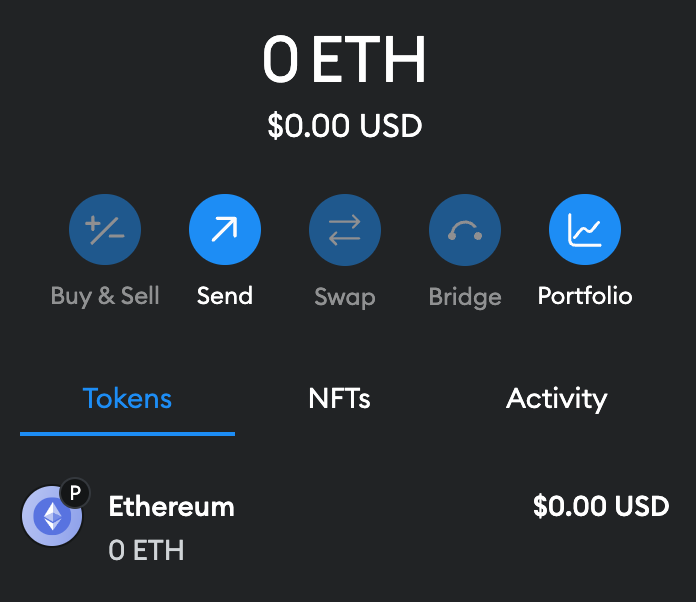

# 连接到Plume

Plume目前作为L2汇总部署在以太坊Sepolia测试网。继续阅读以了解如何连接到Plume测试网，或查看网络参数以获取完整的[网络参数](https://docs.plumenetwork.xyz/plume/developer-resources/network-parameters)列表。

## 1.安装钱包

安装钱包以便与Plume测试网进行交互。Plume支持所有兼容EVM的钱包，包括：

* [MetaMask](https://metamask.io/)
* [Trust Wallet](https://trustwallet.com/)
* [Bitget Wallet](https://web3.bitget.com/)
* [OKX Wallet](https://www.okx.com/web3)
* [Coinbase Wallet](https://www.coinbase.com/wallet)
* [Fox Wallet](https://foxwallet.com/)
* [Binance Web3 Wallet](https://www.binance.com/en/web3wallet)
* [WalletConnect](https://walletconnect.com/)
* [Rainbow](https://rainbow.me/)
* [Phantom](https://phantom.app/)

## 2.桥接到Plume测试网

在你的Plume钱包中一开始不会有任何ETH，但你可以通过将测试网ETH从Sepolia桥接到Plume来轻松获取一些。

<figure><figcaption></figcaption></figure>

首先，从以下水龙头之一获取一些SepoliaETH到你的Sepolia钱包中。交易将在一分钟内确认。

* [Alchemy Faucet](https://sepoliafaucet.com/) （需要Alchemy账户）
* [Infura Faucet](https://www.infura.io/faucet/sepolia) （需要Infura账户）
* [QuickNode Faucet](https://faucet.quicknode.com/ethereum/sepolia) （需要ETH主网有0.001 ETH余额）
* [Sepolia PoW Faucet](https://sepolia-faucet.pk910.de/) （需要你提供算力以防止机器人）

然后，使用 [Plume 测试网桥](https://plume-testnet.calderabridge.xyz/)将 SepoliaETH 桥接到 Plume 上。交易将在三分钟内确认。

<figure><figcaption></figcaption></figure>

## 3.连接到Plume测试网

使用您选择的钱包，导航到设置菜单以手动添加网络。填写网络数据，输入[Plume测试网网络参数](https://docs.plumenetwork.xyz/plume/developer-resources/network-parameters)：

\

| Name               | Value                                                                                    |
| ------------------ | ---------------------------------------------------------------------------------------- |
| Network Name       | Plume Testnet                                                                            |
| HTTP RPC URL       | [https://testnet-rpc.plumenetwork.xyz/http](https://testnet-rpc.plumenetwork.xyz/http)   |
| WebSockets RPC URL | [wss://testnet-rpc.plumenetwork.xyz/ws](wss://testnet-rpc.plumenetwork.xyz/ws)           |
| Chain ID           | 161221135                                                                                |
| Currency Symbol    | ETH                                                                                      |
| Block Explorer URL | [https://testnet-explorer.plumenetwork.xyz/](https://testnet-explorer.plumenetwork.xyz/) |

例如，使用MetaMask连接到Plume测试网的步骤是：

1. 打开MetaMask扩展程序。
2. 点击扩展程序左上角的网络选择按钮。
3.  点击“添加网络”。

    <figure><figcaption></figcaption></figure>
4. 点击“手动添加网络”。
5.  填写上表中的网络参数，然后按“保存”，然后点击“切换到 Plume 测试网”。

    <figure><figcaption></figcaption></figure>

## 4.检查你的Plume测试网余额

您现在应该可以在您的钱包中看到 Plume 测试网上的 ETH 余额。您还可以在[Plume 区块浏览器](https://plume-testnet.explorer.caldera.xyz/)中检查您的钱包地址，以查看您的余额和最近的交易。恭喜您加入 Plume！
